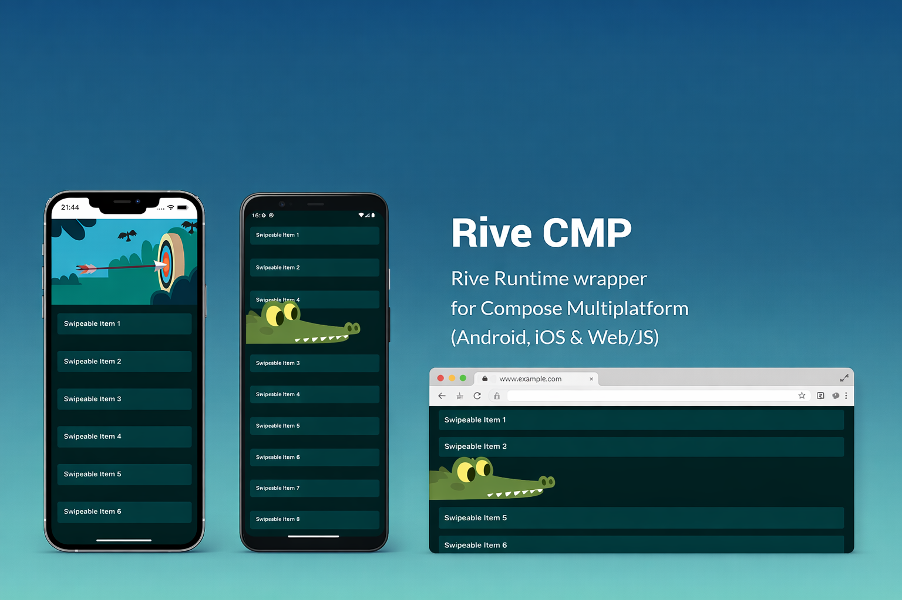

# Rive CMP


[](https://android-arsenal.com/api?level=24)
[](https://kotlinlang.org/docs/multiplatform.html)
[](https://opensource.org/licenses/Apache-2.0)


A Compose Multiplatform wrapper library for integrating Rive animations, providing a unified API to
use rive-android, rive-ios, and @rive-app/canvas seamlessly across Android, iOS, and Web platforms.

</img>

> [!IMPORTANT]
> This project is built and maintained by the open-source community, and is not an official Rive product or supported by Rive.

> **⚠️ EXPERIMENTAL STATUS**
>
> This library is currently in an experimental state. Features, APIs, and implementation details may
> change significantly or the project might be discontinued. Use at your own risk in production
> applications.
>
> **Current Limitations:**
> - ~~On iOS, `UIKitView` does not support transparent backgrounds, resulting in opaque backgrounds for Rive animations. This is a known limitation in Compose Multiplatform. See [Issue #17](https://github.com/muazkadan/Rive-CMP/issues/17) for details and potential workarounds.~~ Fixed in [#42](https://github.com/muazkadan/Rive-CMP/pull/42).
> - Not all features and properties from the native Rive libraries are supported yet
> - Some advanced Rive features may not be available across all platforms

## Features

- **Unified API**: Single `CustomRiveAnimation` composable that works across Android, iOS and Web
- **Multiple Loading Options**: Load animations from URLs, ByteArrays, or pre-composed
  specifications
- **Native Performance**: Uses platform-specific Rive implementations for optimal performance
- **Easy Integration**: Simple Compose-style API with familiar modifier patterns
- **State Machine Support**: Support for Rive state machines on both platforms
- **Flexible Configuration**: Customizable alignment, fit, artboard selection, and playback options
- **Memory Efficient**: Value classes and immutable specifications for optimal performance

## Platform Support

| Platform      | Implementation           | Dependency                |
|---------------|--------------------------|---------------------------|
| Android       | Native rive-android      | `app.rive.runtime.kotlin` |
| iOS           | Swift Package Manager    | `rive-ios` via spm4kmp    |
| Web (JS/Wasm) | NPM package               | `@rive-app/canvas`        |
| Desktop (JVM) | Custom JNI bridge to rive-runtime (C++) | none (bundled native library) |

> [!IMPORTANT]
> **The iOS simulator on Intel Macs is not supported as of 0.4.1.** Compose Multiplatform stopped
> publishing an `iosX64` variant in 1.11, so that target can no longer be built. `iosArm64` (devices)
> and `iosSimulatorArm64` (Apple Silicon simulators) are unaffected. Stay on `0.4.0` if you need
> the Intel simulator.

**Desktop (JVM) is currently macOS arm64 only.** There is no official Rive SDK for JVM/Desktop,
so this bridges directly to the C++ [rive-runtime](https://github.com/rive-app/rive-runtime) via
JNI, rendering through Skia's CPU rasterizer. Linux, Windows, and macOS x64 have the CMake build
logic in place (`native/rive-desktop/`) but aren't built/verified yet - contributions welcome.

## Installation

### Gradle (Kotlin Multiplatform)

Add the dependency to your `build.gradle.kts`:

```kotlin
commonMain.dependencies {
    implementation("dev.muazkadan:rive-cmp:0.4.1")
}
```

### Android-only projects

```kotlin
dependencies {
    implementation("dev.muazkadan:rive-cmp:0.4.1")
}
```

### Version Catalog

Add to your `libs.versions.toml`:

```toml
[versions]
rive-cmp = "0.4.1"

[libraries]
rive-cmp = { module = "dev.muazkadan:rive-cmp", version.ref = "rive-cmp" }
```

## Android Initialization

Rive needs to initialize its runtime when your app starts. You can do this in one of the following
ways:

<details open>
<summary>Using the Initialization Provider</summary>

Add this to your app's manifest file:

```xml

<provider android:name="androidx.startup.InitializationProvider"
    android:authorities="${applicationId}.androidx-startup" android:exported="false"
    tools:node="merge">
    <meta-data android:name="app.rive.runtime.kotlin.RiveInitializer"
        android:value="androidx.startup" />
</provider>
```

</details>

<details>
<summary>Using the AppInitializer</summary>

Call the initializer in your application code:

```kotlin
AppInitializer.getInstance(applicationContext)
    .initializeComponent(RiveInitializer::class.java)
```

</details>

<details>
<summary>Manual Initialization</summary>

Initialize Rive yourself in your code:

```kotlin
Rive.init(context)
```

</details>

## Desktop (JVM) Initialization

Unlike Android (which can auto-initialize via `androidx.startup`) or iOS/JS/Wasm (which need no
initialization at all), the JVM/Desktop target has no automatic startup hook, so you must
initialize Rive explicitly once, before the first `CustomRiveAnimation` or `RiveComposition` is
used - typically at the top of your `main()`:

```kotlin
import dev.muazkadan.rivecmp.RiveDesktop

fun main() {
    RiveDesktop.init()
    application {
        Window(onCloseRequest = ::exitApplication) {
            // your Compose Desktop app
        }
    }
}
```

Safe to call more than once - only the first call does any work.

## iOS Setup

If you encounter undefined symbols errors for Swift classes when building for iOS, manually add the
rive-ios dependency to your Xcode project:

1. In Xcode, go to File > Add Package Dependencies...

2. Enter the package URL: https://github.com/rive-app/rive-ios.git

3. Select version 6.15.2 (exact match to the library's dependency).

4. Add the package to your project.

5. In the target settings, add RiveRuntime to the Frameworks, Libraries, and Embedded Content.

This resolves linking issues with the Rive runtime on iOS.

Alternatively, for advanced users, the library generates a local Swift package at
`library/SPM/spmKmpPlugin/nativeIosShared`. You can add this local package to your Xcode project if
you have the source cloned. See [spm4kmp documentation](https://github.com/frankois944/spm4kmp) for
details.

Note: The library uses spm4kmp to integrate rive-ios, but manual addition may be required in some
setups.

## Basic Usage

### Direct Animation Loading

```kotlin
import dev.muazkadan.rivecmp.CustomRiveAnimation
import dev.muazkadan.rivecmp.utils.ExperimentalRiveCmpApi

@OptIn(ExperimentalRiveCmpApi::class)
@Composable
fun MyScreen() {
    CustomRiveAnimation(
        modifier = Modifier.size(200.dp),
        url = "https://your-rive-animation-url.riv"
    )
}
```

### Composition-based Loading (Recommended)

```kotlin
import dev.muazkadan.rivecmp.CustomRiveAnimation
import dev.muazkadan.rivecmp.RiveCompositionSpec
import dev.muazkadan.rivecmp.rememberRiveComposition
import dev.muazkadan.rivecmp.utils.ExperimentalRiveCmpApi

@OptIn(ExperimentalRiveCmpApi::class)
@Composable
fun MyScreen() {
    // URL-based composition
    val urlAnimation by rememberRiveComposition {
        RiveCompositionSpec.url("https://cdn.rive.app/animations/your_animation.riv")
    }

    // Resource-based composition
    val resourceAnimation by rememberRiveComposition {
        RiveCompositionSpec.byteArray(Res.readBytes("files/your_animation.riv"))
    }

    Column {
        CustomRiveAnimation(
            modifier = Modifier.size(200.dp),
            composition = urlAnimation
        )

        CustomRiveAnimation(
            modifier = Modifier.size(200.dp),
            composition = resourceAnimation
        )
    }
}
```

## API Reference

### CustomRiveAnimation (Direct URL)

```kotlin
@ExperimentalRiveCmpApi
@Composable
fun CustomRiveAnimation(
    modifier: Modifier = Modifier,
    url: String,
    alignment: RiveAlignment = RiveAlignment.CENTER,
    autoPlay: Boolean = true,
    artboardName: String? = null,
    fit: RiveFit = RiveFit.CONTAIN,
    stateMachineName: String? = null,
)
```

### CustomRiveAnimation (Direct ByteArray)

```kotlin
@ExperimentalRiveCmpApi
@Composable
fun CustomRiveAnimation(
    modifier: Modifier = Modifier,
    byteArray: ByteArray,
    alignment: RiveAlignment = RiveAlignment.CENTER,
    autoPlay: Boolean = true,
    artboardName: String? = null,
    fit: RiveFit = RiveFit.CONTAIN,
    stateMachineName: String? = null,
)
```

### CustomRiveAnimation (Composition-based)

```kotlin
@ExperimentalRiveCmpApi
@Composable
fun CustomRiveAnimation(
    modifier: Modifier = Modifier,
    composition: RiveComposition?,
    alignment: RiveAlignment = RiveAlignment.CENTER,
    autoPlay: Boolean = true,
    artboardName: String? = null,
    fit: RiveFit = RiveFit.CONTAIN,
    stateMachineName: String? = null,
)
```

### RiveCompositionSpec Factory Methods

```kotlin
// Create URL-based composition spec
RiveCompositionSpec.url(url: String): RiveCompositionSpec

// Create ByteArray-based composition spec  
RiveCompositionSpec.byteArray(byteArray: ByteArray): RiveCompositionSpec
```

### rememberRiveComposition

```kotlin
@Composable
fun rememberRiveComposition(
    vararg keys: Any?,
    spec: suspend () -> RiveCompositionSpec,
): State<RiveComposition?>
```

#### Parameters

- `modifier`: Compose modifier for styling and layout
- `url`: URL to the Rive animation file (direct loading)
- `byteArray`: ByteArray containing the Rive animation data (direct loading)
- `composition`: Pre-loaded `RiveComposition` from `rememberRiveComposition` (recommended)
- `alignment`: How the animation should be aligned within its container (default:
  `RiveAlignment.CENTER`)
- `autoPlay`: Whether the animation should start playing automatically (default: `true`)
- `artboardName`: Optional name of the specific artboard to use
- `fit`: How the animation should fit within its container (default: `RiveFit.CONTAIN`)
- `stateMachineName`: Optional name of the state machine to use

## Requirements

### Android

- Minimum SDK: 24
- Compile/Target SDK: 37
- Kotlin: 2.4+
- Compose Multiplatform: 1.12+
- AGP: 9.3.2+ (Gradle 9.7+)

> Kotlin 2.4+ is a hard floor, not a recommendation: the published artifacts are built with
> Kotlin 2.4.20, and consumers on 2.3.x will hit Kotlin metadata incompatibilities.

### iOS

- Minimum iOS: 14.0
- Xcode: 15+
- Swift: 5.9+
- Apple Silicon required for simulator builds (see the `iosX64` note above)

### Web (JS/Wasm)

- Compose Multiplatform: 1.12+
- Kotlin/JS with IR compiler
- Browser environment

### Desktop (JVM)

- macOS arm64 only
- JDK 11+

## Building

The project has four Gradle modules:

- **`library`** – The Rive CMP library (KMP: Android, iOS, JS, Wasm, JVM/Desktop)
- **`sample`** – Shared sample UI and logic (KMP library; also the Desktop, JS and Wasm entry point)
- **`androidSample`** – Android app entry point (run this for the Android sample)
- **`runtime-macos-arm64`** – Ships the prebuilt `librive-desktoparm64.dylib` for JVM/Desktop

plus **`native/rive-desktop/`**, a CMake project for the JNI bridge. It is *not* part of the default
Gradle build - `:library:jvmMain` consumes the prebuilt binary instead. See
[`native/rive-desktop/README.md`](native/rive-desktop/README.md) for how to build it, the pinned
`rive-runtime` commit, and the provenance of the shipped binary.

The library uses Kotlin Multiplatform with the following plugins:

- `kotlinMultiplatform`
- `androidMultiplatformLibrary` (AGP 9–compatible Android-KMP library plugin)
- `composeMultiplatform`
- `composeCompiler`
- `spmForKmp` (for iOS Swift Package Manager integration)

```bash
# Build and run the Android sample app
./gradlew :androidSample:installDebug

# Run the Desktop (JVM) sample
./gradlew :sample:run

# Run the Wasm sample in a browser (http://localhost:8080)
./gradlew :sample:wasmJsBrowserDevelopmentRun

# Run the JS sample in a browser (http://localhost:8080)
./gradlew :sample:jsBrowserDevelopmentRun

# Build Android AAR
./gradlew :library:assembleRelease

# Build iOS Framework
./gradlew :library:linkReleaseFrameworkIosArm64
```

> [!NOTE]
> `./gradlew build` currently fails on `checkComposeUiTestConfigurationForJs` /
> `...ForWasmJs`, a Compose Multiplatform 1.12 check
> ([CMP-4906](https://youtrack.jetbrains.com/issue/CMP-4906)) whose suggested fix conflicts with the
> `binaries.library()` output this project publishes. Assembling, publishing and running the
> samples are unaffected - use the per-target tasks above.

To run the sample in Android Studio, use the **androidSample** run configuration (not `sample`).

## Contributing

1. Fork the repository
2. Create a feature branch (`git checkout -b feature/amazing-feature`)
3. Commit your changes (`git commit -m 'Add amazing feature'`)
4. Push to the branch (`git push origin feature/amazing-feature`)
5. Open a Pull Request

### Development Setup

1. Clone the repository
2. Open in Android Studio or IntelliJ IDEA
3. Sync Gradle dependencies
4. For iOS development, ensure Xcode is installed
5. Only if you intend to build the native desktop bridge, fetch the pinned Rive runtime:

   ```bash
   git submodule update --init --recursive submodules/rive-runtime
   ```

   This is not needed for normal development - the JVM target uses the prebuilt binary in
   `runtime-macos-arm64`. The checkout and its Skia build are large (several GB).

## License

```
Copyright 2025 Muaz KADAN

Licensed under the Apache License, Version 2.0 (the "License");
you may not use this file except in compliance with the License.
You may obtain a copy of the License at

    http://www.apache.org/licenses/LICENSE-2.0

Unless required by applicable law or agreed to in writing, software
distributed under the License is distributed on an "AS IS" BASIS,
WITHOUT WARRANTIES OR CONDITIONS OF ANY KIND, either express or implied.
See the License for the specific language governing permissions and
limitations under the License.
```

## Author

**Muaz KADAN**

- Website: [muazkadan.dev](https://muazkadan.dev/)
- Email: muaz.kadan@gmail.com
- GitHub: [@muazkadan](https://github.com/muazkadan)

## Acknowledgments

- [Rive](https://rive.app/) for the amazing animation platform
- [rive-android](https://github.com/rive-app/rive-android) for Android implementation
- [rive-ios](https://github.com/rive-app/rive-ios) for iOS implementation
- [@rive-app/canvas](https://www.npmjs.com/package/@rive-app/canvas) for Web implementation
- [spm4kmp](https://github.com/frankois944/spm4kmp) for Swift Package Manager integration